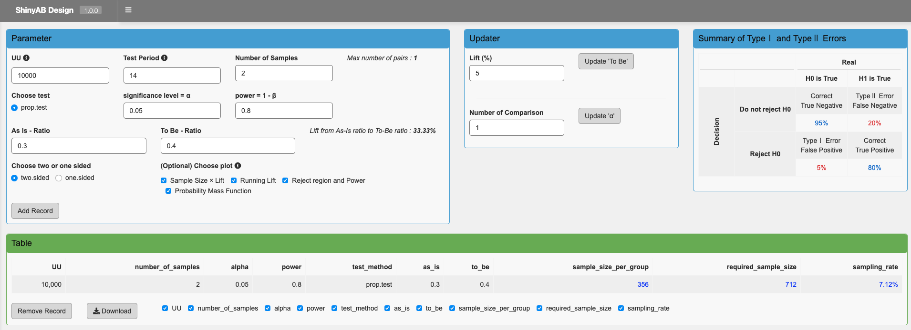
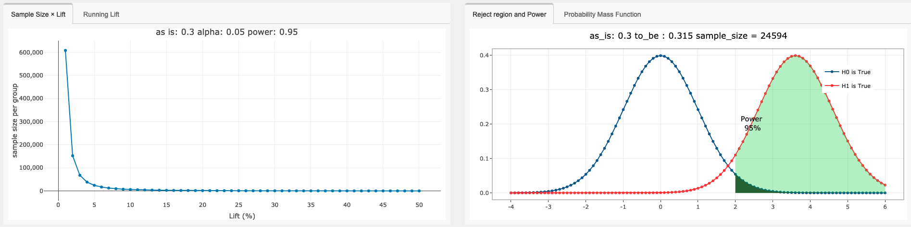

# ShinyAB

This application is a shiny apps calculator of sample size for AB test which is a framework to investigate significant different between control and treatment groups. 

This app built in Shiny Dashboard includes the following functions.
1. Caliculate sample size to design AB Test using `power.prop.test`
2. Understand statistical Type I and II error using visual table built in `kableExtra`
3. Visualze effect and distribution for AB Test using `plotly` and `ggplot2`

## Shinyapps
https://gingi99.shinyapps.io/ShinyAB/

## Stats Feature 
* Support experimental plan for `power.prop.test`
* Output table about experimental paramters and sample size and using `kableExtra`

## Visual Feature

Inspired by timwilson7, I added plot Lift running day from his great [posts](https://www.searchdiscovery.com/blog/sample-size-calculation-myth-buster-edition/).

## Shinyloadtest

[shinyloadtest report](https://okiyuki99.github.io/ShinyAB/shinyloadtest_report.html)

## Reference
* [Shiny Contest Submission : ShinyAB - Shiny Apps Calculator of Sample Size for AB test](https://community.rstudio.com/t/shiny-contest-submission-shinyab-shiny-apps-calculator-of-sample-size-for-ab-test/25675)

