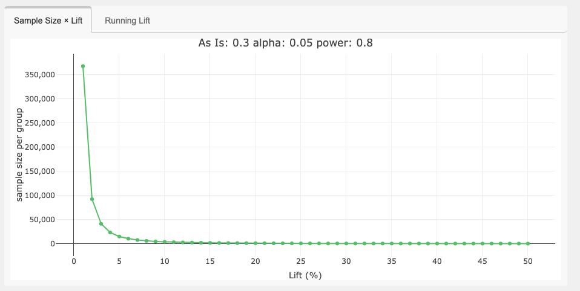
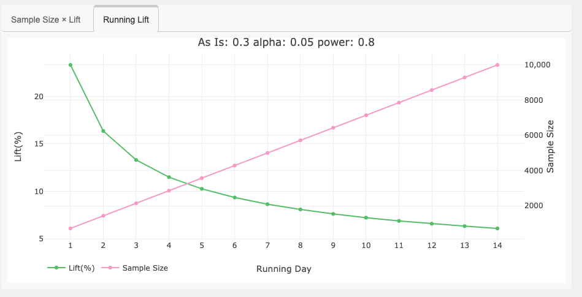
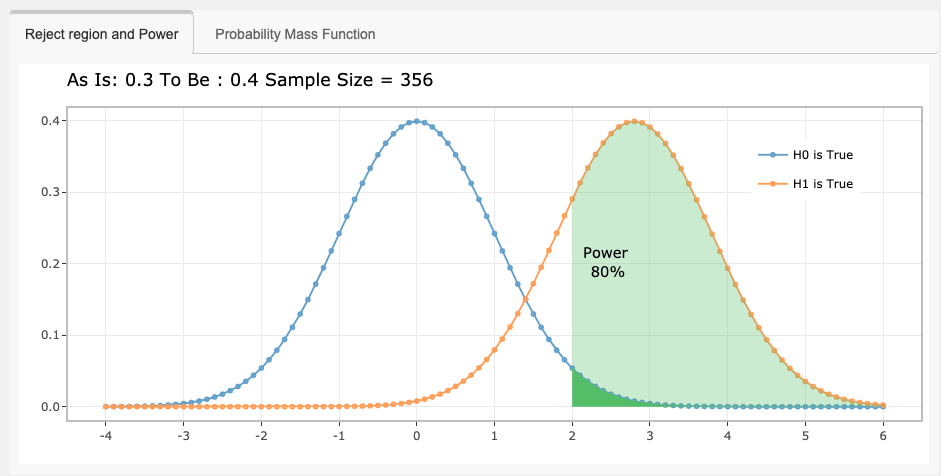
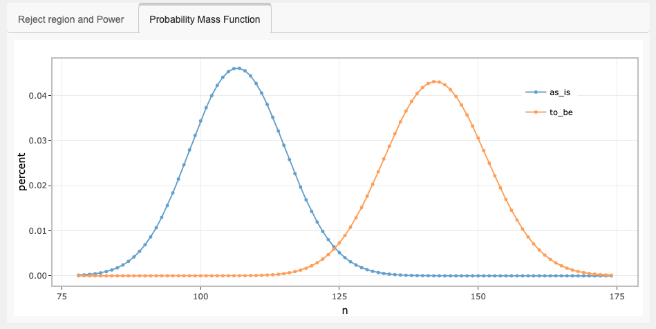

# ShinyAB 

This application is a shiny app calculator of sample size for AB test which is a statistical approach to compare control and treatment groups. 

This app built in shiny dashboard contains the following functions.
1. Calculation of sample size to design AB Test using `power.prop.test`
2. Informative tables for supporting understanding of statistical Type I and II error 
3. Various visualization of control and treatment groups regarding AB Test using `plotly` and `ggplot2`

## Shinyapps
https://okiyuki.shinyapps.io/ShinyAB/

## Stats Feature 
* Support experimental plan for `power.prop.test`
* Informative tables about experimental paramters and sample size and using `kableExtra`

## Sceeenshot 

## Visual Feature 1 - Sample Size × Lift 

## Visual Feature 2 - Running Lift

Inspired by timwilson7, I implemented this Running Lift plot from his great [posts](https://www.searchdiscovery.com/blog/sample-size-calculation-myth-buster-edition/).

## Visual Feature 3 - Reject region and Power

Inspired by [this post](http://ethen8181.github.io/Business-Analytics/ab_tests/frequentist_ab_test.html), I implemented this plot on this shinyapp.

## Visual Feature 4 - Probability Mass Function

## Shinyloadtest

[shinyloadtest report](https://okiyuki99.github.io/ShinyAB/shinyloadtest_report.html)

## Reference
* [Shiny Contest Submission : ShinyAB - Shiny Apps Calculator of Sample Size for AB test](https://community.rstudio.com/t/shiny-contest-submission-shinyab-shiny-apps-calculator-of-sample-size-for-ab-test/25675)

